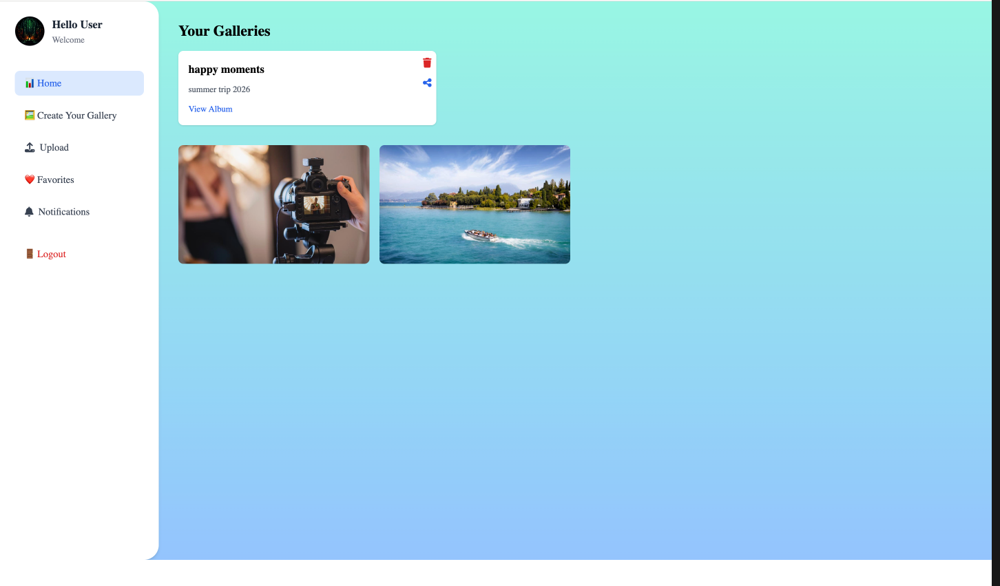
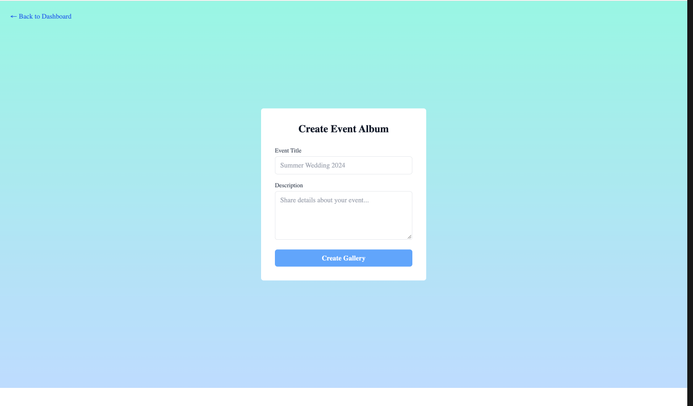

# 📸 ShutterUp

A full-stack photo sharing platform where users can upload photos, organize them into galleries, and share them publicly via secure links with real-time-style notifications when someone views, likes, or comments.

Built to demonstrate end-to-end full-stack development: secure authentication, cloud media handling, RESTful API design, and a responsive React frontend.

<!-- Optional: add a live demo link and screenshot once deployed
🔗 **Live Demo:** [shutterup.example.com](#) -->

## 📸 Screenshots

**Landing Page**


| Dashboard | Create Gallery |
|---|---|
|  |  |


---

## ✨ Overview

ShutterUp is a MERN-stack application built to solve a real product problem: letting someone upload photos, curate them into galleries, and share a single gallery link publicly, without forcing viewers to create an account, while still notifying the owner of engagement (views, likes, comments) on that gallery.

## 🚀 Features

- **Authentication** — JWT-based auth with short-lived access tokens + long-lived refresh tokens stored in httpOnly cookies
- **Email verification** — new accounts must confirm their email (Nodemailer/Gmail SMTP) before logging in
- **Password reset** — secure, time-limited token sent via email
- **Cloud image uploads** — photos stream directly to Cloudinary (in-memory, no temp files on disk) with automatic resizing/optimization
- **Galleries** — create, view, and delete galleries; add photos to a gallery
- **Public sharing** — generate a unique share link per gallery; viewers need no account
- **Social engagement** — anonymous viewers can like and comment on photos in a shared gallery
- **Notifications** — gallery owners get notified on views/likes/comments, with mark-as-read and clear-all
- **Profile management** — update name, email, and profile picture

## 🛠️ Tech Stack

**Backend**

| Technology | Purpose |
|---|---|
| Node.js / Express 5 | Server & REST API |
| MongoDB / Mongoose | Database & ODM |
| JWT (jsonwebtoken) | Access & refresh token authentication |
| bcryptjs | Password hashing |
| Cloudinary | Image hosting & transformation |
| express-fileupload | Multipart/form-data file handling |
| Nodemailer | Verification & password-reset emails |
| cookie-parser, cors, dotenv | Middleware & configuration |

**Frontend**

| Technology | Purpose |
|---|---|
| React 19 | UI |
| React Router 7 | Client-side routing |
| Vite | Dev server & build tool |
| Tailwind CSS | Styling |
| Font Awesome | Icons |


## 📁 Project Structure

### Backend

```text
backend/
├── config/
│   └── cloudinary.js
│
├── controllers/
│   ├── authController.js
│   ├── galleryController.js
│   ├── notificationController.js
│   ├── postController.js
│   └── userController.js
│
├── middleware/
│   └── authMiddleware.js
│
├── models/
│   ├── Gallery.js
│   ├── Notification.js
│   ├── Post.js
│   └── User.js
│
├── routes/
│   ├── authRoutes.js
│   ├── galleryRoutes.js
│   ├── notificationsRoutes.js
│   ├── postRoutes.js
│   └── userRoutes.js
│
├── utils/
│   ├── notification.js
│   └── upload.js
│
├── app.js
└── package.json
```

### Frontend

```text
frontend/
├── src/
│   ├── components/
│   │   └── Navbar
│   │
│   ├── dashboard/
│   │   ├── Dashboard
│   │   ├── Upload
│   │   ├── PhotoGrid
│   │   ├── PhotoModal
│   │   └── Sidebar
│   │
│   ├── gallery/
│   │   ├── Gallery
│   │   ├── GalleryDetail
│   │   ├── GalleryCard
│   │   └── ImageCard
│   │
│   ├── notification/
│   │   ├── Notifications
│   │   ├── SharedGalleryPrompt
│   │   └── SharedGalleryView
│   │
│   ├── pages/
│   │   ├── Home
│   │   ├── Login
│   │   ├── Signup
│   │   └── ResetPassword
│   │
│   ├── profile/
│   │   └── Profile
│   │
│   ├── util/
│   │   ├── AuthContext
│   │   ├── ProtectedRoute
│   │   ├── photoAPI
│   │   └── profileAPI
│   │
│   ├── App.jsx
│   └── main.jsx
│
├── tailwind.config.js
├── vite.config.js
└── package.json
```


## 🔑 Environment Variables

Create a `.env` file inside `backend/` (never commit this file — it's already gitignored):

```env
PORT=5000
MONGODB_URI=your_mongodb_connection_string
JWT_SECRET=your_access_token_secret
REFRESH_SECRET=your_refresh_token_secret
FRONTEND_URL=http://localhost:5173

EMAIL_USERNAME=your_gmail_address
EMAIL_PASSWORD=your_gmail_app_password

CLOUDINARY_CLOUD_NAME=your_cloud_name
CLOUDINARY_API_KEY=your_api_key
CLOUDINARY_API_SECRET=your_api_secret
```

> Email delivery uses Gmail SMTP (`smtp.gmail.com:465`) — `EMAIL_PASSWORD` should be a Gmail **App Password**, not your account password.

## ▶️ Getting Started

**Prerequisites:** Node.js, a MongoDB instance (Atlas), and a free [Cloudinary](https://cloudinary.com) account.

**1. Clone the repo**
```bash
git clone https://github.com/saima-riaz/ShutterUp.git
cd ShutterUp
```

**2. Backend**
```bash
cd backend
npm install
# add .env file (see above)
npm start
```
Runs on `http://localhost:5000`.

**3. Frontend**
```bash
cd frontend
npm install
npm run dev
```
Runs on `http://localhost:5173` (Vite proxies `/api` requests to the backend).

## 📡 API Reference

**Auth** — `/api/auth`
| Method | Endpoint | Description |
|---|---|---|
| POST | `/register` | Register a new user, sends verification email |
| GET | `/verify-email/:token` | Verify email address |
| POST | `/login` | Log in, sets accessToken/refreshToken cookies |
| POST | `/refresh-token` | Refresh the access token |
| POST | `/logout` | Clear auth cookies |
| POST | `/request-password-reset` | Send password reset email |
| POST | `/reset-password/:token` | Reset password with token |

**Posts** — `/api/posts` (auth required)
| Method | Endpoint | Description |
|---|---|---|
| POST | `/` | Upload a photo (multipart, field `image`) |
| GET | `/` | Get current user's photos |
| DELETE | `/:id` | Delete a photo (also removed from Cloudinary) |

**Galleries** — `/api/gallery`
| Method | Endpoint | Auth | Description |
|---|---|---|---|
| GET | `/public/:token` | No | View a shared gallery by share token |
| POST | `/create` | Yes | Create a gallery |
| GET | `/` | Yes | List current user's galleries |
| GET | `/:url` | Yes | Get one gallery by its slug URL |
| POST | `/:url/add-photo` | Yes | Add a photo to a gallery |
| POST | `/:id/share` | Yes | Enable sharing, returns a share URL |
| POST | `/:id/unshare` | Yes | Disable sharing |
| DELETE | `/:_id` | Yes | Delete a gallery |

**Notifications** — `/api/notifications`
| Method | Endpoint | Auth | Description |
|---|---|---|---|
| POST | `/like` | No | Like a photo in a shared gallery |
| POST | `/comment` | No | Comment on a photo in a shared gallery |
| POST | `/` | Yes | Create a "gallery viewed" notification |
| GET | `/` | Yes | Get all notifications |
| DELETE | `/` | Yes | Clear all notifications |
| PATCH | `/mark-read` | Yes | Mark all notifications as read |

**Users** — `/api/user` (auth required)
| Method | Endpoint | Description |
|---|---|---|
| GET | `/profile` | Get current user's profile |
| PUT | `/profile` | Update profile (firstName, lastName, email, profilePic) |


## 📄 License

This project is licensed under the [MIT License](./LICENSE).

## 👤 Author

**Saima CORBONNOIS-RIAZ**
